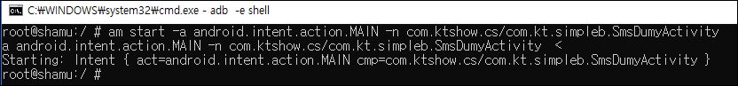
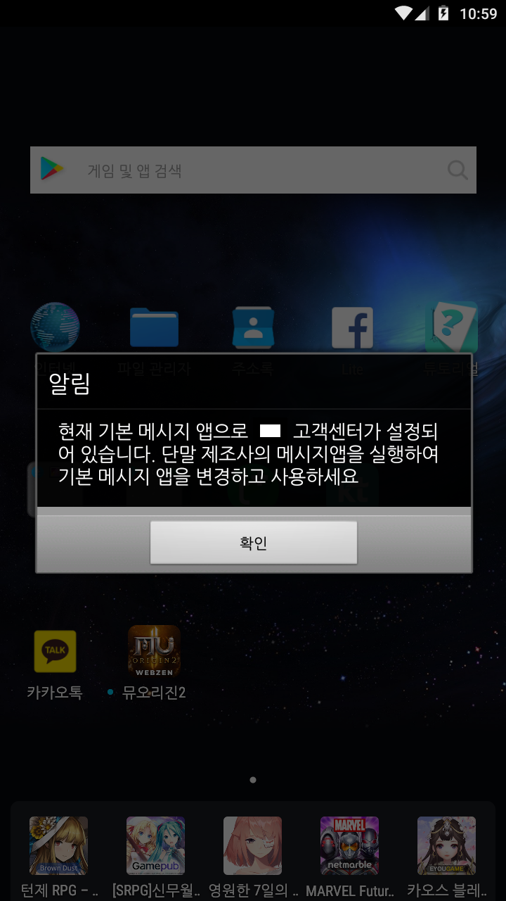

## exported=true 설정 취약점

안드로이드 애플리케이션에서 manifest.xml 파일에 android:exported=“true”로 설정되어 있는 컴포넌트는 
외부에서 해당 컴포넌트에 인텐트를 전달하여 활성화 시킬 수 있습니다.
이 경우 해당 컴포넌트가 원래 의도하지 않았던 상황에서 수행을 시작함으로써 시스템 보안에 침해를 가져올 수 있습니다. 
또한 이러한 작업 요청은 인텐트를 라우팅 하는 리졸버(resolver) 액티비티를 통하여 System 레벨 사용자 권한으로 송신자의 ID가 바뀌어 
전송되므로 보안침해의 위험이 커집니다.

### 안드로이드 컴포넌트 종류

<b> 1) 액티비티 (activity) </b>  
액티비티는 안드로이드 어플리케이션의 화면을 담당하는 컴포넌트입니다.

<b>2) 서비스 (service)</b>  
서비스는 액티비티의 실행 여부와 상관없이 백그라운드로 작동하는 컴포넌트입니다. 
액티비티는 서비스를 실행할 수 있습니다. 그러면  나중에 액티비티가 다른 것에 가려지더라도 서비스는 계속해서 작동합니다.

<b>3) 브로드캐스트 리시버 (broadcast receiver)</b>  
브로드캐스트(broadcast)란, 모든 앱들이 받을 수 있는 메시지입니다.안드로이드에서 시스템 이벤트가 발생할 때, 
안드로이드는 앱들에게 브로드캐스트를 보냅니다. 
브로드캐스트 리시버는 안드로이드가 보내는 브로드캐스트를 받고 이에 대응하는 어떤 작업을 수행할 수 있는 컴포넌트입니다.

부팅이 완료될 때  
화면이 켜질 때  
화면이 꺼질 때  
날짜가 변경될 때  
시간이 변경될 때  
SMS 문자 메시지를 받을 때  
외장 메모리 카드를 기기에 꽂을 때  
외장 메모리 카드를 기기로부터 뺄 때  
 
<b>4) 컨텐트 프로바이더 (content provider)</b>  
안드로이드에서 어플리케이션들이 데이터를 공유하기 위해서는 별도의 앱 컴포넌트가 필요합니다. 그것이 바로 컨텐트 프로바이더입니다.
즉, 컨텐트 프로바이더는 어플리케이션들이 공유할 수 있도록 자료를 제공하는 앱 컴포넌트입니다.

### am 명령어를 통한 activity 실행
안드로이드 앱 manifest.xml에서 디폴트로 exported=false로 설정되어 있으나, 해당 컴포넌트에 인텐트 필터를 설정할 경우 exported 설정이 true로 변경됩니다. 따라서 intent-filter가 설정된 activity에 exported=false설정이 없을 경우 am 명령어를 통해 실행시킬 수 있습니다.
아래는 실습이 대상이될 앱의 manifest.xml 일부입니다.

<code>

        <activity android:launchMode="singleTask" android:name="com.xx.simpleb.SmsDumyActivity" android:theme="@android:style/Theme.Translucent.NoTitleBar">
            <intent-filter>
                <action android:name="android.intent.action.SEND"/>
                <action android:name="android.intent.action.SENDTO"/>
                <category android:name="android.intent.category.DEFAULT"/>
                <category android:name="android.intent.category.BROWSABLE"/>
                <data android:scheme="sms"/>
                <data android:scheme="smsto"/>
                <data android:scheme="mms"/>
                <data android:scheme="mmsto"/>
            </intent-filter>
        </activity>
        
</code>

- adb로 단말에 연결한 후 am 명령어를 이용하여 아래와 같은 형식에 맞추어 입력합니다. 
  
<code>
 am start -a android.intent.action.MAIN -n 패키지명/액티비티 경로명
 </code>  
 아래와 같이 activity가 실행된 것을 확인할 수 있습니다. 
 
 
 이 외에도 아래 명령어로 실행가능 하니 참고 하시면 됩니다.
 
갤러리 실행 

am start -a android.intent.action.GET_CONTENT -t image/jpeg  

카메라 실행 

am start -a android.media.action.IMAGE_CAPTURE

환경설정 실행

am start -a android.intent.action.MAIN -n com.android.settings/.Settings

브라우저로 구글띄우기

am start -a android.intent.action.VIEW http://www.google.com

전화걸기 다이얼 입력 

am start -a android.intent.action.DIAL tel:010XXXXXXX

전화걸기 

am start -a android.intent.action.CALL tel:010XXXXXXX

