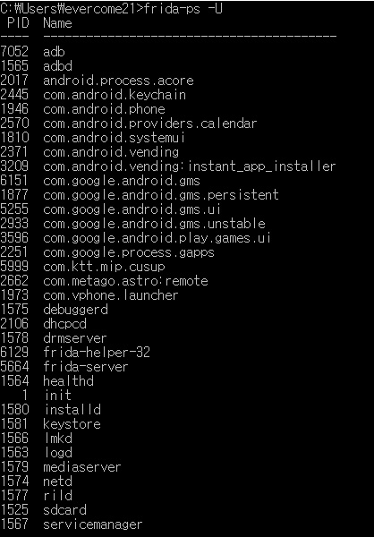
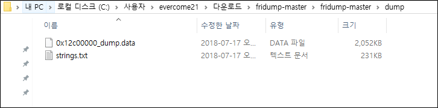

## 메모리 내 민감 정보 저장

메모리는 주기억 장치라고도 하며, 물리적 메모리 램(RAM)을 말합니다. 
애플리케이션이 실행되면 일정량의 메모리를 차지하고 실행 중에 필요한 정보들이 저장됩니다. 
우리가 앱에 입력하는 모든 입력값과 앱이 실행되는 모든 정보들이 메모리에 적재되어 실행한 후 실행이 완료되면 다른 데이터들로 채워지며, 
메모리는 휘발성이기 때문에 프로그램이나 모바일이 종료되면 데이터 들도 삭제 됩니다.

이 장에서는 frida, adb, gdb를 이용한 메모리 덤프를 알아보겠습니다.

### frida를 이용한 메모리 덤프
frida는 DBI(Dynamic Binary Instrumentation)이라고도 하는 동적 바이너리 조사를 가능하게 해주는 도구입니다. 

1) 우선 클라이언트 PC에 python의 pip를 이용하여 frida-server를 설치합니다.
<pre><code>pip install frida-server==10.0.0 
</pre></code>

(저 같은 경우엔 10 버전이 정상 동작 되어 해당 버전으로 설치하였으며 환경에 맞는 버전 설치하시면 됩니다.)

2)  https://github.com/frida/frida/releases에서 단말기에서 실행할 frida-server 파일을 설치하여 adb 명령를 
이용하여 /data/local/tmp 디렉토리에 설치합니다.(저같은 경우엔 frida-server로 바이너리 파일 이름을 변경하였습니다.)

3) frida-server 파일을 실행한 후 ps 명령어를 이용하여 실행되고 있는 frida를 확인합니다.
<pre><code>./frida-server
ps | grep server
</pre></code>

4) adb를 나와서 클라이언트 PC에서 frida-ps -U 명령어를 통하여 단말기에서 실행되고 있는 프로세스 정보를 확인합니다.
<pre><code>frida-ps -U
</pre></code>

5) 이후 클라이언트 PC에서 실행되는 앱의 덤프를 추출하기위해 fridump파일이 필요합니다. 해당 파일은 https://github.com/Nightbringer21/fridump 
이곳에서 설치할 수 있습니다.

6) 설치 후 덤프를 뜨기위한 app패키지 네임을 아래와 같은 명령어로 추출합니다.
<pre><code>python fridump.py -u -s [app package name]
</pre></code>

7) 아래와 같이 dump 경로에 덤프파일을 확인할 수 있습니다. 

### adb를 이용한 메모리 덤프
adb를 이용한 메모리덤프는 frida를 이용한 방법보다 비교적 간단합니다.
1) 먼저 디바이스에 adb로 접속한 후 ps명령어를 이용하여 pid를 확인해둡니다.
<pre><code>adb shell
ps | grep google.android.play
</pre></code>

2) 이후 am명령어의 dumpheap 옵션으로 앱의 힙메모리를 추출합니다.
<pre><code>adb -e shell am dumpheap [pid] [filename]
</pre></code>

3) 정상적으로 파일이 생성되었다면 adb pull 명령어를 이용하여 로컬 PC로 파일을 이동합니다.

<pre><code>adb pull [파일경로] [로컬경로]
</pre></code>

4) 추출한 덤프 파일을 eclipse에서 지원하는 MAT(Memory Analyzer Tool)와 같은 프로그램으로 분석하기위해선 변환이 필요합니다.
<pre><code>hprof-conv.exe [덤프된파일] [새로 생성 될파일]
</pre></code>

5) 추출된 덤프파일은 Hxd로 분석 가능합니다.

### gdb를 이용한 메모리 덤프
