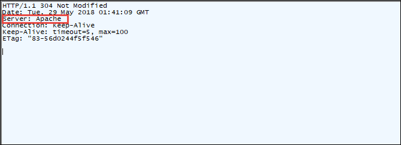

### SSL PINNING 
최근 대부분의 앱에서 프록시 툴(burp, fiddler)을 이용하여 동적진단이 어려워졌습니다..

이유는 SSL PINNING에 있습니다. 최근 구글, 트위터, 금융앱 등에서 SSL PINNING은 이용하고 있는데,

앱은 디바이스의 신뢰할 수 있는 저장소를 무시하고 자체적으로 앱 내부에 저장된 인증서로 서명된 호스트에 SSL 연결을 맺고있습니다. 따라서 우리는 디바이스에 버프인증서와 같은 프록시 툴 인증서로 SSL 연결을 맺기 어려워졌습니다.

하지만 위의 과정은 클라이언트 측 (앱)에서 이루어지는 것이기 때문에 frida 혹은 별도 툴로 우회할 수 있는데, 이번엔 루팅되지 않는 안드로이드 환경에서 SSL PINNING 우회할 수 있는 두 가지 기술에 대해 알아보겠습니다.

### 1. Xposed Framework
개인적인 생각으로 Xposed Framework는 IOS의 cydia와 비슷하다는 생각이드는데요. 기술적으로는 여러가지 차이점이 있겠지만 두 가지 앱 모두 공식적으로 설치할 수 있는 앱이 아닌 사용자가 원하는 특수한 기능이 탑재된 앱을 이용하기 위함이고 그것을 배포하고 있기 때문입니다..

사실 Xposed Frimework를 설치하기 위해선 Xposed Installer에서 리커버리 모드에 진입하여 friamework를 설치해야하기 때문에 루팅이 된 단말에서 설치하려 동작시킬 수 있지만, 녹스에뮬레이터 환경에선 루팅을 활성/비활성 할 수 있는 기능이 있기 때문에 루팅 환경에서 프레임워크 및 이용하고자 하는 모듈(앱)을 설치하고 루팅을 비활성화 한 후 기능을 동작시킬 수 있습니다. 

먼저 우리는 다운로드 받을게 3가지 있습니다.

1. Xposed Installer apk (https://forum.xda-developers.com/showthread.php?t=3034811)
2. Xposed Framework ZIP (http://dl-xda.xposed.info/framework/)
  sdk 21: 안드로이드 5.0
  sdk 22: 안드로이드 5.1
  sdk 23: 안드로이드 6.0
  기기의 대부분은 arm 으로 다운받으시면 됩니다.
3. https://github.com/Fuzion24/JustTrustMe/releases/tag/v.2

출처: https://kgezzang.tistory.com/362 [크즈닷컴]
Xposed Installer apk를 녹스에 설치한 후 실행시킵니다. 
참고로 롤리팝(5.X)버전으로 테스트를 진행했으며, 최근엔 누가(7.X)버전에서도 안정화 되었다고 하니 각 환경에 맞게 진행하면 될 것 같습니다.

### 옵션
ServerTokens Prod : Apache
ServerTokens Min : Apache 버전
ServerTokens OS : Apache 버전 및 운영체제(설치 시 Default)
ServerTokens Full : 모든 정보

### 조치 결과

아래와 같이 Prod로 설정시 Apache만 확인할 수 있습니다.

