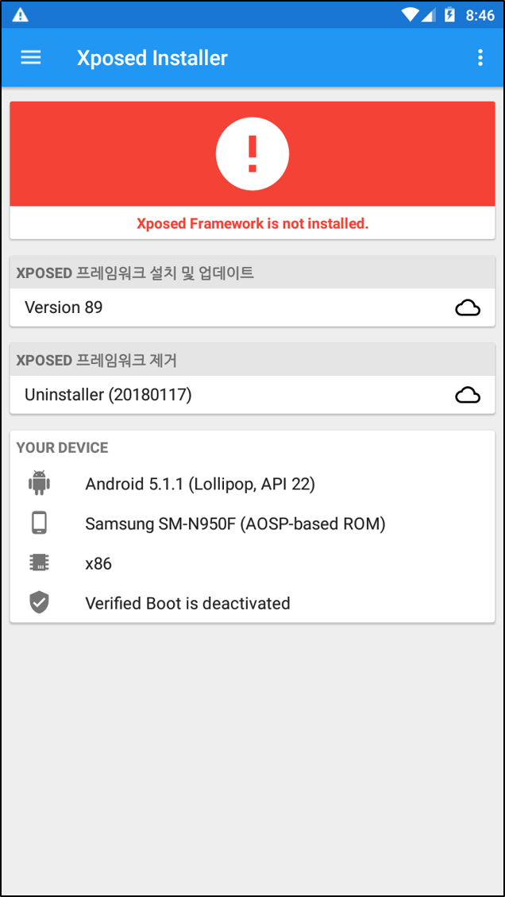
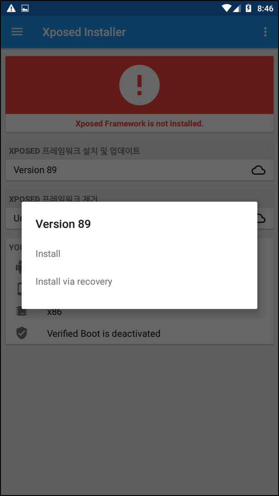
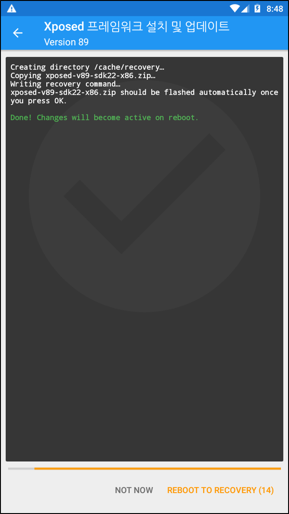
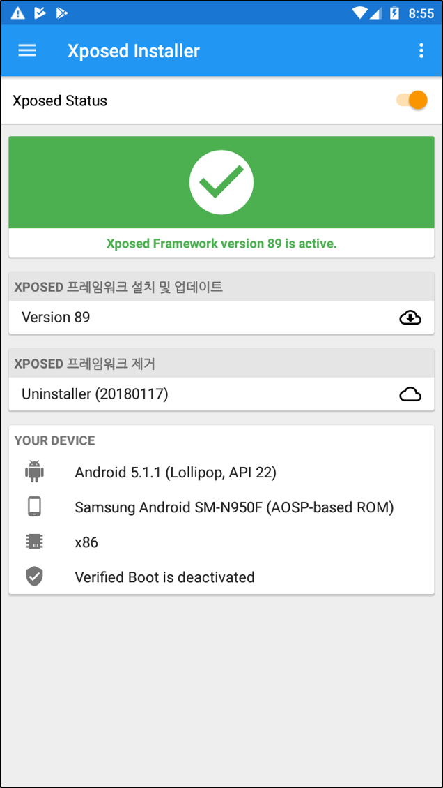
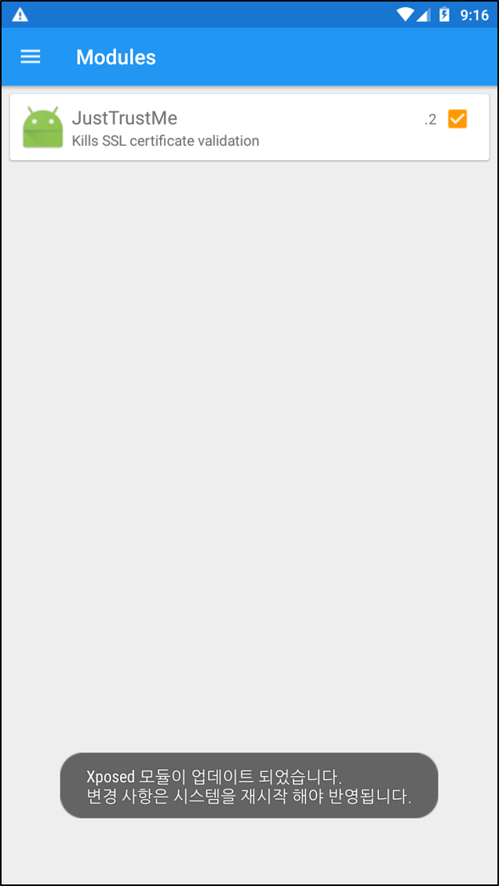
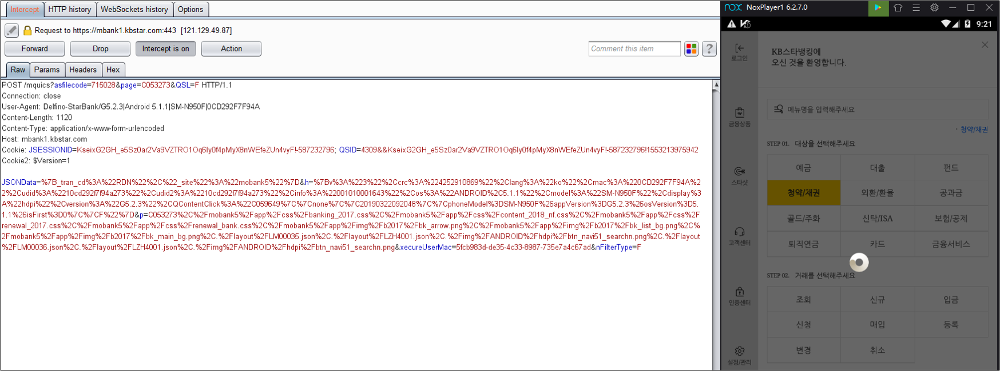

### SSL PINNING 
최근 대부분의 앱에서 프록시 툴(burp, fiddler)을 이용하여 동적진단이 어려워졌습니다..

이유는 SSL PINNING에 있습니다. 최근 구글, 트위터, 금융앱 등에서 SSL PINNING은 이용하고 있는데,

앱은 디바이스의 신뢰할 수 있는 저장소를 무시하고 자체적으로 앱 내부에 저장된 인증서로 서명된 호스트에 SSL 연결을 맺고있습니다. 따라서 우리는 디바이스에 버프인증서와 같은 프록시 툴 인증서로 SSL 연결을 맺기 어려워졌습니다.

하지만 위의 과정은 클라이언트 측 (앱)에서 이루어지는 것이기 때문에 frida 혹은 별도 툴로 우회할 수 있는데, 이번엔 루팅되지 않는 안드로이드 환경에서 SSL PINNING 우회할 수 있는 두 가지 기술에 대해 알아보겠습니다.

## 1. Xposed Framework
Xposed Framework는 프레임워크로 해당 프레임워크를 설치한 후 여러가지 모듈들을 작동시킬 수 있습니다.

사실 Xposed Frimework를 설치하기 위해선 Xposed Installer에서 리커버리 모드에 진입하여 friamework를 설치해야하기 때문에 루팅이 된 단말에서 설치하려 동작시킬 수 있지만, 녹스에뮬레이터 환경에선 루팅을 활성/비활성 할 수 있는 기능이 있기 때문에 루팅을 활성화 한 후 프레임워크 및 이용하고자 하는 모듈을 설치하고 루팅을 비활성화 한 후 우회 기능을 동작시킬 수 있습니다. 
  
먼저 Xposed Framework를 설치하기위해 우리는 아래 2 가지 항목을 다운로드받아야합니다.

Xposed Installer apk (https://forum.xda-developers.com/showthread.php?t=3034811)
JustTrustMe apk (실제 pinning우회 기능을 하는 모듈) https://github.com/Fuzion24/JustTrustMe/releases/tag/v.2
(참고로 롤리팝(5.X)버전으로 테스트를 진행했으며, 최근엔 누가(7.X)버전에서도 안정화 되었다고 하니 각 환경에 맞게 진행하면 될 것 같습니다.)

그리고 adb install XposedInstaller_3.1.5.apk 명령어 혹은 에뮬레이터에 apk를 마우스로 끌어다 놓으면 xposed installer가 설치됩니다.

### Xposed Framework 설치

설치된 xposed installer을 실행 시키면 아래와 같은 화면이 출력됩니다.

XPOSED 프레임워크 설치 및 없데이트 메뉴를 눌러 Install 한 후 단말기를 재시작합니다.

xposed installer 를 실행시키면 정상적으로 프레임워크가 설치되었음을 확인할 수 있습니다.

### JustTrustMe 설치

그리고 adb install XposedInstaller_3.1.5.apk 명령어 혹은 에뮬레이터에 apk를 마우스로 끌어다 놓으면 JustTrustme가 설치됩니다.

설치된 후 xposed installer에서 위의 모듈을 활성화 시켜줘야 하는데 Modules메뉴에서 활성화 시켜주시면 됩니다.

그리고 녹스 에뮬레이터에서 루팅을 비활성화 한 후 앱을 실행시키면 아래와 같이 SSL Pinning가 우회 되는 것을 확인할 수 있습니다.

## 2. frida-gadget
위와 같이 xposed를 사용해서 sslpinning를 하여 동적진단을 모든앱에서 가능하다면 정말 좋겠지만.
솔루션에서 xposed를 악성앱으로 탐지하여 실행이 되지 않는 경우가 있습니다.
여러가지 삽집을 통해 확인 한 xposed 외에 다른 방법으로는 frida-gadget를 사용하는 방법이 있습니다.

frida를 사용하기 위해선 루팅이된 환경에서 frida-server 단말에서 실행시키고 클라이언트에서 frida 명령어를 통해 단말과 attach 시킨 후 hooking을 할 수 있었습니다.
결론적으로 단말에서 frida-server을 실행시키는 것이 frida를 사용할 수 있는 가장 중요한 점이었고 그것을 위해서는 단말이 루팅이 된 상태여야만 했습니다. 그러나 대부분의 앱들에서 루팅을 차단하고 있었고 frida를 사용하기가 어려웠는데..

그러던 중 frida-gadget이라는 툴을 찾았습니다.

frida-gadget은 frida와는 frida-server을 실행시키는 방법이 달랐는데,
앱의 lib폴더에 frida-server파일을 넣고 바이너리코드에 frida-server를 실행시키는 구조입니다.
결론적으로 앱을 실행 시켰을 때 앱이 실행되면서 자동으로 lib내의 frida-server를 실행시킵니다.
그런 후 클라이언트에서 frida 명령어를 통해 단말과 attach 한 후 hooking코드를 실행시키면 됩니다.

과정은 아래와 같습니다.

1. 앱 추출
2. 디컴파일
3. 메인 액티비티 smali코드에 아래코드 삽입하고 frida-gadget 라이브러리 삽입
const-string v0, "frida-gadget"
invoke-static {v0}, Ljava/lang/System;->loadLibrary(Ljava/lang/String;)V 

메인액티비티 찾는법은 앱 실행 시킨 후 adb shell "dumpsys window windows | grep -E 'mCurrentFocus|mFocusedApp'"
명령어 치면 현재 뷰에 대한 경로가 나오고 그 근처가 main activity 

4. 앱 컴파일 후 설치

5. 앱 실행 하면서  frida -U gadget -l hook.js

물론 앱에서 무결성 체크를 하면 위의 방법도 안됩니다.. ㅎㅎ

위의 과정은 별도로 게시할 예정입니다.
