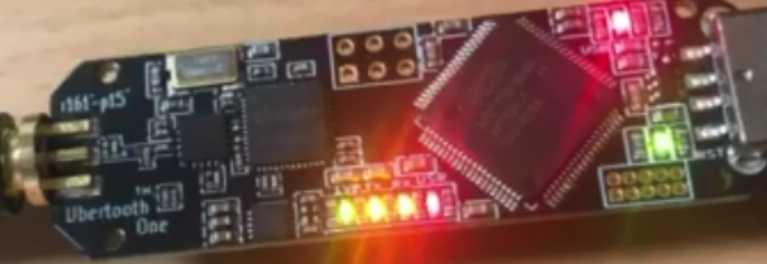

### ubertooth

ubertooth를 이용한 BLE 스니핑에 대한 내용입니다.

칼리리눅스 2019.3 에서 테스트 되었습니다.

libbtbb 설치하기

sudo apt-get install cmake libusb-1.0-0-dev make gcc g++ libbluetooth-dev pkg-config libpcap-dev python-numpy python-pyside python-qt4

wget https://github.com/greatscottgadgets/libbtbb/archive/2018-12-R1.tar.gz

tar xf libbtbb-2018-12-R1.tar.gz

cd libbtbb-2018-12-R1

mkdir build

cd build

cmake ..

make

sudo make install

libbtbb의 build 디렉터리에서 ubertooth tools 설치하기(설치 경로 : ~/libbtbb-2018-12-R1/build/)

# wget https://github.com/greatscottgadgets/ubertooth/archive/2018-12-R1.tar.xz

tar xf ubertooth-2018-12-R1.tar.xz

cd ubertooth-2018-12-R1/host

mkdir build

cd build

cmake ..

make

sudo make install

### wireshark 플러그인

apt-get install wireshark wireshark-dev libwireshark-dev cmake

cd libbtbb-2018-12-R1/wireshark/plugins/btbb

mkdir build

cd build

cmake -DCMAKE_INSTALL_LIBDIR=/usr/lib/x86_64-linux-gnu/wireshark/libwireshark3/plugins ..

make

sudo make install

cd libbtbb-2018-12-R1/wireshark/plugins/btbredr

mkdir build

cd build

cmake -DCMAKE_INSTALL_LIBDIR=/usr/lib/x86_64-linux-gnu/wireshark/libwireshark3/plugins ..

make

sudo make install

### Ubertooth를 Linux에서 인식

echo 'ACTION=="add" BUS=="usb" SYSFS{idVendor}=="1d50" SYSFS{idProduct}=="6002" GROUP:="plugdev" MODE:="0660"' > /etc/udev/rules.d/99-ubertooth.rules

cd libbtbb-2018-12-R1/build/ubertooth-2018-12-R1

cp -r host/build/misc/udev/ /etc/udev/rules.d/

udevadm control --reload-rules

재부

### 블루투스 패킷 스니핑

/etc/init.d/bluetooth start

mkfifo /tmp/pipe

wireshark 실행 및 Capture options 에서 인터페이스 관리접근.

Pipes 탭에서 + 버튼으로 /tmp/pipe 추가

추가한 인터페이스를 캡처 시작(start) 및 아래 명령어로 캡처

ubertooth-btle -f -c /tmp/pipe

Edit - Preference에 들어 간 후, Protocols를 선택 후, DLT_USER항목에서 btle 입력

### could not open Ubertooth device unable to find ubertooth 에러

vm과 하드웨어(ubertooth one)이 제대로 연결되지 않은 상황이므로, vm을 전체화면으로 하여 재연결 후 led 상태 확인

